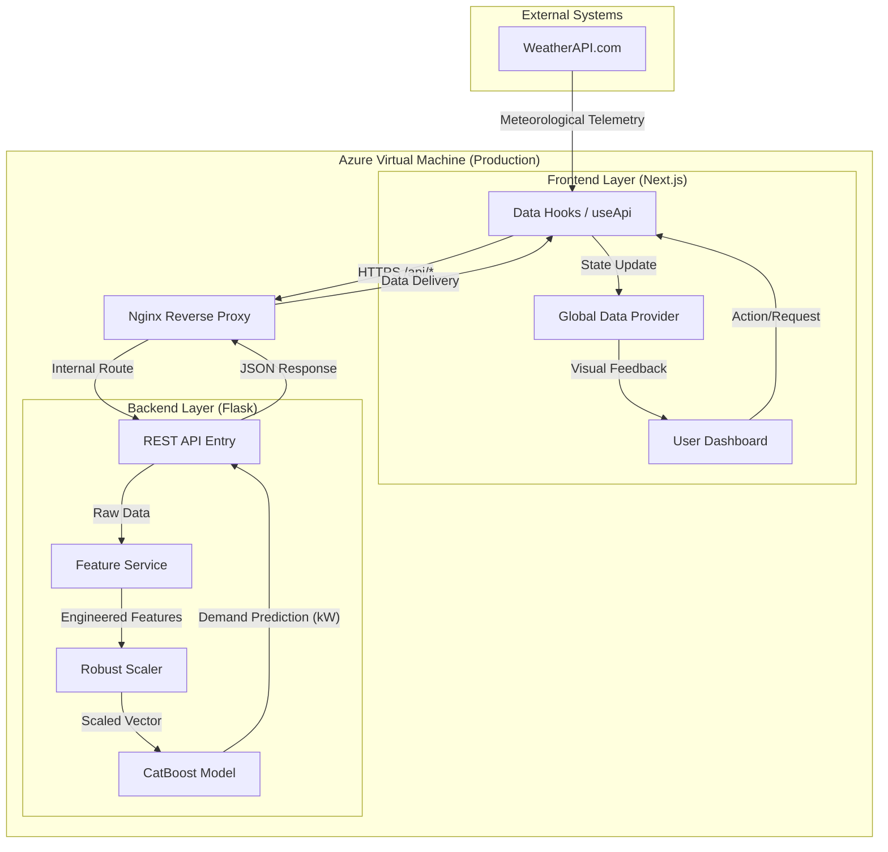

# Forecast Driven District Heating Control

This repository contains the source code and research documentation for an MSc initiative focused on optimizing district heating systems through machine learning.

## Project Context and Objectives

District heating involves large-scale thermal distribution where demand is highly sensitive to external variables such as temperature, wind chill, and building thermal mass. This project aims to:
1. **Reduce Energy Waste**: By predicting demand 24-48 hours in advance, operators can modulate heat production more accurately, avoiding costly "peak-shaving" or overproduction.
2. **Feature Engineering Research**: Investigating the impact of Heating Degree Hours (HDH) and temporal lags on prediction accuracy.
3. **Operational HUD**: Providing a professional dashboard that translates complex ML metrics into actionable situational awareness.

---

## System Capabilities

### 🧠 Machine Learning Engine
The backend is powered by a **CatBoost** regressor, chosen for its superior handling of categorical temporal features and robust performance with non-linear thermal data.
- **Feature Engineering**: The system automatically generates features like `HDH` (Heating Degree Hours), rolling temperature averages, and 3-hour/6-hour lags to capture the "thermal inertia" of buildings.
- **RESTful API**: A Flask-based service serves predictions in milliseconds, with built-in CORS security and environment-aware configuration.

### 🖥️ Analytical HUD
The interface is a high-performance **Next.js 15** application designed for clarity and precision.
- **Dashboard**: Real-time view of current weather, building specifications, and immediate heat demand.
- **Weather Explorer**: Interactive charts for temperature, wind speed, and humidity trends.
- **Prediction Matrix**: A 24-hour horizon view that allows operators to see the predicted "load ramp-up" for the following day.
- **Validation Dashboard**: A transparency layer showing model R² scores, Mean Absolute Percentage Error (MAPE), and historical correlation between actual vs. predicted telemetry.

---

## Technology Stack

| Layer | Technologies |
| :--- | :--- |
| **Frontend** | React 19, Next.js 15 (App Router), TypeScript, Tailwind CSS, Recharts, Framer Motion |
| **Backend** | Python 3.10+, Flask, Gunicorn, CatBoost, Scikit-learn, joblib, Pandas |
| **Infrastructure** | Azure Linux VM (Standard_B2ats_v2), Terraform, Nginx, PM2 |
| **Security** | SSL/TLS (Certbot/Let's Encrypt), Azure NSG, Secure Environment Variables |

---

## System Architecture & Data Flow



### Technical Workflow
1.  **Meteorological Acquisition**: The frontend fetches real-time meteorological data via the `useWeather` hook.
2.  **Inference Sequence**: When a prediction is requested, the telemetry is sent to the Flask backend.
3.  **Feature Engineering**: The backend `FeatureService` processes raw data into engineered features (HDH, Lags).
4.  **Model Scoring**: Features are normalized by the `RobustScaler` and scored by the `CatBoost` model.
5.  **Visualization**: The result is returned as JSON and rendered in the dashboard using Recharts.

---

## Getting Started

### Prerequisites
- **Python 3.9+** and **Node.js 18+** installed.
- A free API key from [WeatherAPI.com](https://www.weatherapi.com/).

### Installation

1. **Clone and Backend Setup**
   ```bash
   git clone https://github.com/harmohanjohal/MSc_Research_Project.git
   cd MSc_Research_Project/apps/backend
   pip install -r requirements.txt
   # Ensure model files (.pkl and .json) are present in this folder
   python app.py
   ```

2. **Frontend Setup**
   ```bash
   cd ../frontend-simple
   npm install
   ```
   Create a `.env.local` file:
   ```env
   NEXT_PUBLIC_WEATHER_API_KEY=your_weather_key
   NEXT_PUBLIC_API_URL=http://localhost:5000
   ```
   Launch the dashboard:
   ```bash
   npm run dev
   ```

---

## Deployment and Infrastructure

This project includes a complete **Terraform** configuration to deploy the stack to an Azure Virtual Machine. 

- **Infrastructure as Code**: The `terraform/` directory defines the entire network, security group, and VM configuration.
- **Automated Provisioning**: The `scripts/setup.sh` file handles the installation of Nginx, Node.js, and Python on the cloud instance during the first boot.
- **Production Management**: Nginx acts as a reverse proxy, while PM2 ensures both the Next.js and Flask services remain online 24/7.

For detailed deployment steps, including pointing your domain and SSL setup, refer to [deploy.md](./terraform/deploy.md).

---

## Project Structure

- `apps/frontend-simple`: Next.js frontend code including the API hooks and UI components.
- `apps/backend`: Flask API, ML model loading logic, and feature engineering service.
- `data`: Serialized model files (`.pkl`), scalers, and metadata.
- `terraform`: HCL files for Azure provisioning and server setup scripts.
- `building_data`: Historical research data, processing scripts, and training notebooks.

---

**Disclaimer**: This project is part of a Master of Science (MSc) research program. The information provided is for analytical purposes and should not be used as the sole basis for physical plant operations without human verification.
